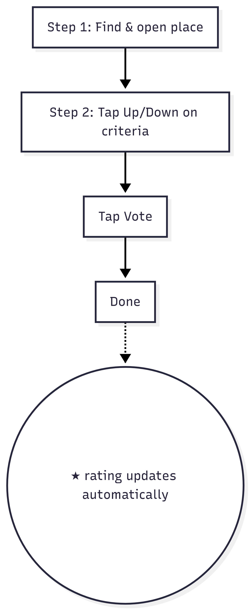

# ThumbStars Pitch: A Faster, Smarter Google Reviews Replacement

## Problem
Google Reviews is powerful but clunky. Users must:
- Write detailed reviews or pick a 1–5 star rating, often requiring multiple clicks and decisions.
- Wade through inconsistent, biased ratings (e.g., one bad 1-star review skews the average).
- Spend time thinking about nuanced scores, reducing participation.

This friction discourages quick feedback, especially on mobile, and small-sample ratings can mislead users (e.g., 5★ from one vote).

## Solution: ThumbStars
**ThumbStars** replaces Google’s star-based system with a **binary thumbs-up/down** approach, integrated with Google Places API. Users vote 👍 or 👎 on specific aspects (e.g., Service, Cleanliness, Value) in **2 clicks or less**, producing a reliable 1–5 star rating. It’s faster, more engaging, and delivers high-quality ratings with minimal effort.

### Why ThumbStars?
- **Fewer Clicks**: Search, tap thumbs, done—2 clicks vs. Google Reviews’ 5+ (open form, select stars, submit, optional text).
- **Higher Engagement**: Simple thumbs boost participation, especially on mobile.
- **Better Ratings**: Bayesian smoothing ensures fair scores, even with few votes.
- **Google Synergy**: Seamlessly uses Google Places API for trusted place data and compliance.
- **Fun UX**: Animated chips and instant updates make reviewing addictive.

## How It Works
1. **Search**: User types a place name (e.g., “Joe’s Coffee Shop”). Google Places API autocompletes in 1 click.
2. **Vote**: Tap 👍 or 👎 on criteria like Service, Cleanliness, Value (1–2 clicks).
3. **See Results**: Instant animations show updated stars (e.g., 3.5★) and vote counts (e.g., “Based on 137 votes”).

**Total Clicks**: 2 (search + vote) vs. Google Reviews’ 5–7 (open review, select stars, optional text, submit). 

See below for diagram - 

### Example
- **Place**: Joe’s Coffee Shop
- **Votes**: Service (8👍, 2👎), Cleanliness (3👍, 0👎), Value (1👍, 1👎)
- **Result**: 3.5★ rating, displayed as “Service: 71% 👍, Cleanliness: 71% 👍, Value: 50% 👍”
- **Confidence**: “High confidence” badge for 30+ votes per criterion; “Early rating” otherwise.

## User Journey
```
Start: Open ThumbStars
  |
Search for a place (1 click)
  | Google Places API autocomplete
Select a place
  |
View Place Card (Name, Address, Stars: 3.5★)
  |
See Criteria Chips (Service: 71% 👍, Cleanliness: 71% 👍, Value: 50% 👍)
  |
Vote: Tap 👍 or 👎 (1–2 clicks)
  | Instant animation
Submit Vote
  |
Refresh Place Card (New stars: 3.5★, "Based on 137 votes")
  |
Optional: Click "See reviews on Google"
  |
End
```

**Visual**: [Insert `user_journey.jpg` from repo or Mermaid-rendered flowchart in pitch slides.]

## Scoring Simplified
- **Binary Votes**: 👍 (+1) or 👎 (-1) per criterion.
- **Smart Math**: Bayesian smoothing prevents skewed ratings (e.g., 8👍, 2👎 → 71% score, not 100% or 0%).
- **Star Output**: Combines criteria scores into a 1–5 star rating, rounded to half-stars for display.
- **Example**: 8👍/2👎 (Service), 3👍/0👎 (Cleanliness), 1👍/1👎 (Value) → 3.5★.

## Why Google Should Adopt ThumbStars
1. **Boost Engagement**: 2-click voting increases review volume, especially on mobile, where Google Reviews lags.
2. **Enhance Quality**: Structured criteria (Service, Value) and smoothing deliver more reliable ratings than freeform stars.
3. **Seamless Integration**: Uses Google Places API for place data, linking back to Google Reviews for transparency.
4. **Anti-Abuse**: Anonymous `user_hash`, vote limits, and bot detection ensure trust without storing PII.
5. **Scalable**: Lean data model (Place, Criterion, Vote, Aggregate) handles millions of users.

## Google Compliance
- **No Scraping**: Collects first-party thumbs data.
- **Places API**: Uses `google_place_id` for names, addresses, and links (e.g., “See reviews on Google”).
- **Terms**: Adheres to Google Places API policies (https://developers.google.com/places/web-service/policies).

## Roadmap
- **MVP (3 Months)**: Launch with search, thumbs voting, star ratings, Google Places integration, mobile-first UI.
- **Phase 2 (6 Months)**: Add custom criteria (e.g., “Food Quality”), confidence badges, embeddable widgets for businesses.
- **Phase 3 (12 Months)**: Optional user profiles, analytics for businesses, integration with Google Maps UI.

## Call to Action
Replace Google Reviews’ clunky star system with **ThumbStars**. It’s faster (2 clicks), smarter (reliable ratings), and built for Google’s ecosystem. Let’s pilot ThumbStars on Google Maps, driving more reviews and better insights for users and businesses.
